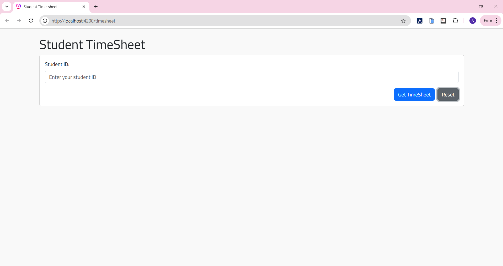
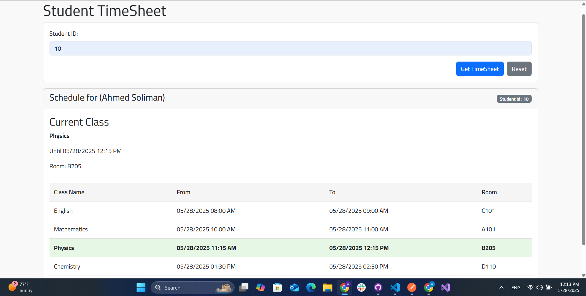
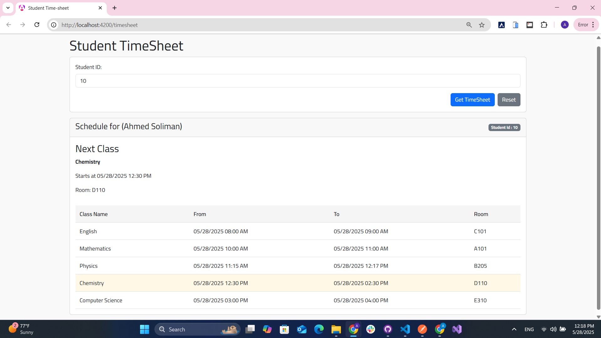
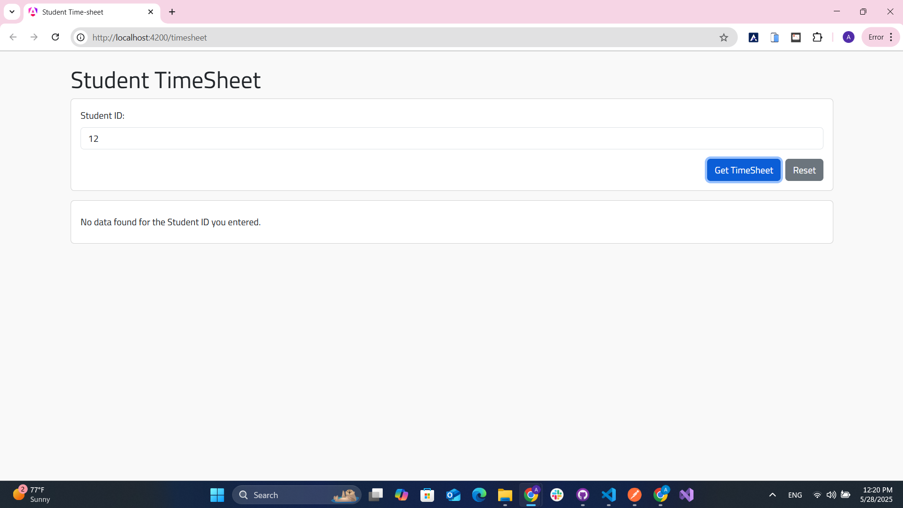

# Student Time‑Sheet

## 1 What you’ll see

| Entered ID    | Outcome                           |
| ------------- | --------------------------------- |
| **10**        | Ahmed Soliman’s schedule (200 OK) |
| Anything else | JSON error + 404 toast            |

Rows are shaded **Current Class** or **Next Class** in real‑time using the browser clock.

## 2 Run locally _(no backend to start)_

npm install # dependencies
ng serve -o # http://localhost:4200/schedule

## 3 Mock API (Postman)

- **Note** :
        The mock response times (startTime, endTime) are hardcoded ISO strings. I intentionally used static timestamps instead of dynamic ones.

        Why?
        While Postman mock servers support built-in variables like {{$isoTimestamp}}, they do not support logic such as adding durations (e.g. +30 minutes) or referencing request values dynamically. That means it’s not possible to generate a true “current” or “next” class in real time through the mock.

        Result:
        To correctly simulate a “Current Class” or “Next Class” in the Angular frontend, you’ll need to manually adjust the startTime and endTime fields in the mock example to match the current time.

        This is a limitation of Postman’s mock engine, not of the Angular logic itself. Once updated, the mock will reflect those changes immediately.

- **Import collection** `./postman/Student‑TimeSheet.postman_collection.json`
- **BaseURL** `https://cf58209c-2992-4b6c-bfbd-ae4fb5eb1fb7.mock.pstmn.io`
- **Endpoint** `POST /api/student/schedule`
- **Header** `sessionID` = `btoa(<timestamp>-<studentId>)` (added automatically by Angular)
- **Examples**

  - **Success** → body `{"studentId":"10"}` → returns schedule Data
  - **Not Found** → any other student id → returns `{ message:"Not found data" }` with HTTP 404

## 4 Architecture & Patterns

core/
  services/       # Strategy fetchers
  facade/         # TimesheetFacade (Façade)
  interceptors/   # Auth interceptor + error handling interceptor
schedule/         # lazy‑loaded feature module
  schedule-list/  # table & highlight
  current-class/  # banner (current / next)

| Pattern          | Role                                                                                           |
| ---------------- | ---------------------------------------------------------------------------------------------- |
| **Strategy**     | Swap `MockScheduleFetcher` for real backend with one provider change.                          |
| **Façade**       | Components call one method `getStudentSchedule(id)`; no HTTP in UI layer.                      |
| **Date mapping** | Facade merges HH\:mm strings from mock with _today’s_ date so highlight logic is always valid. |

## 5 Tech stack

| Purpose | Library               |
| ------- | --------------------- |
| Layout  | Bootstrap 5.3         |
| Font    | Google Font **Cairo** |
| Toasts  | ngx‑toastr            |
| Spinner | ngx‑spinner           |

Disable or swap by editing `angular.json` & `app.module.ts`.

## 6 Highlight logic (shared `DateUtils`)

now >= start && now <= end      // current class
start > now && start‑now <= 1h  // next class

## 7 Screenshots

### Initial Page

### After Submitting Student ID (with current class highlighted)

### After Submitting Student ID (with next class highlighted)

### After Submitting Student ID (without data or error)

_Created by Ahmed Soliman – feel free to open issues or questions._
